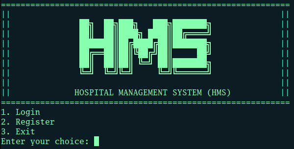

# SC2002 - HMS 🏥

>Hospital Management System Application



## 📂 Project Folder Structure

### High Level Directory Layout
```
.
├── build                   # Compiled .jar file
├── docs                    # Javadocs generated as HTML
├── src                     # Source files (all the codes)
└── README.md
```

### Source Files
```
src
├── controller              # Manager classes for application logic
├── database                # Classes handling data storage and retrieval
├── helper                  # Utility/helper classes
├── model                   # Data models representing core entities
├── view                    # View/Interface classes for user interaction
└── main                    # Main Class file
```

## 📝 Running the Application
1. Clone the repository
    ```
    git clone https://github.com/EldonLim/SC2002-HMS.git
    ```
2. Navigate the project directory
    ```
    cd SC2002-HMS
    ```
3. Running the application
    ```
    java -jar ./build/SC2002-HMS.jar
    ```

## 📃 Documentation
1. Make sure you are at root directory
    ```
    javadoc -d ./docs .src/*/*java
    ```
2. launch the `index.html` under ./docs/index.html
    - Window
      ```
      start ./docs/index.html
      ```
    - Linux
      ```
      xdg-open ./docs/index.html
      ```
    - MacOS
      ```
      open ./docs/index.html
      ```

## ‼️ Requirements
- **Java Version**: 21.0.5